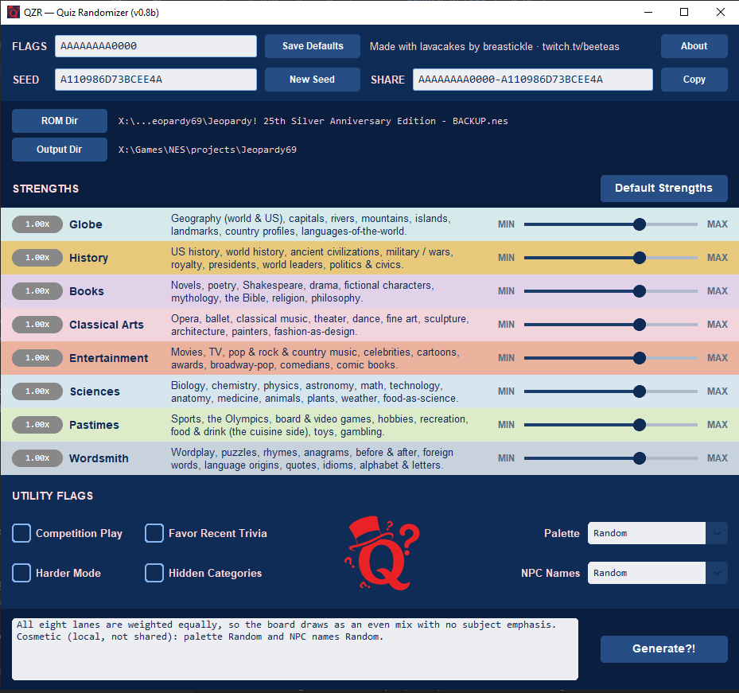

# QZR — Quiz Randomizer · **OPEN BETA** (`v0.8b`)

A deterministic randomizer for the NES *Jeopardy! 25th Anniversary Edition*.
Feed it a clean ROM, pick your flavor, get back a fresh 29-game cartridge that
nobody asked for but everybody needs. The purpose of this is trivial, for
educational and study purposes, for you to learn trivia, for me to learn about
6502 assembly.

It's a beta. Things are cooked, sus, etc.

[Join me and other lavacakes on discord to discuss](https://discord.gg/Q23NMHem4g)

---
## ⬇️ [**Download the latest release here**](https://github.com/breastickle/qzr-beta/releases) - Scroll to "Assets" and locate your OS
---
<p align="center">
  
</p>
---

## New here? Read this first

**The game.** *Jeopardy! 25th Anniversary Edition* is a 1990 Nintendo (NES) video
game of the classic TV quiz show — you play a contestant, pick categories, and answer
trivia "in the form of a question," Daily Doubles and Final Jeopardy and all. The
catch: the original cartridge has a **fixed** set of questions, so once you've played
through them, you've seen them all — replay value gone.

**What QZR does.** QZR is a small tool (not the game itself) that rebuilds that
cartridge with **fresh trivia** pulled from a database of **45,000+ 
clues**. Pick the subjects you want, hit **Generate**, and it spits out a new game
file you load in an NES emulator. It's different every time — so the game becomes
endlessly replayable, and a sneaky-good way to **study trivia**.

---

## What's in `v0.8b`?

A **~10% slice** of the full corpus — every lane cut to roughly a tenth of its
categories, so beta play still exercises the whole database in miniature.

| Lane | Categories (full → slice) | J/DJ clues |
| --- | ---: | ---: |
| Globe | 1,085 → 108 | 1,794 |
| History | 1,115 → 112 | 2,282 |
| Books & Poetry | 979 → 98 | 1,729 |
| Stage | 605 → 60 | 1,917 |
| Music/Cinema/TV | 1,066 → 107 | 1,192 |
| Math & Science | 812 → 81 | 2,194 |
| Sports & Leisure | 625 → 62 | 643 |
| Wordsmith | 4,448 → 445 | 4,996 |
| **Total** | **10,735 → 1,073** | **16,747** |

- **45,482 clues** in the slice — **16,747** are J/DJ-eligible (the board pool); Final
  Jeopardy draws from all 45,482, across 17,643 distinct categories.
- **1,066** unique J/DJ categories (1,073 lane×category draw units — a few names span lanes).
- Biggest category: **OPERA** (579 Qs, Stage) · smallest: **WORLD LANDMARKS** (5, Globe)
  · longest name: **SHAKESPEAREAN CHARACTERS** (24 chars).

---

## 0) CRC Facts

**Base ROM — *Jeopardy! 25th Anniversary Edition* (NES, NTSC)**

| | |
| --- | --- |
| File | one `.nes`, iNES-headered |
| Size | **131,088 bytes** (128 KB + 16-byte header) |
| CRC32 | **`FB72E586`** |
| MD5 | `E46AF543D87CA6FFD7E39C3636B2CCF2` |
| SHA-1 | `44AE6D2E2FFB202F3BBDB678FCADE84340415B4E` |

*(Matching against a No-Intro set instead? The headerless CRC32 is `0BDD8DD9`.)*

**Every ROM QZR hands back validates itself.** There's no master checksum to look
up — a randomizer makes a different ROM per setting. Instead, each build is fully
described by its **FLAGS + SEED + version**, which are:

- **stamped on the title screen**, and
- **baked into the filename:** `QZR_<flags>_<seed>.nes`
  e.g. `QZR_AAAAAAAA0000_3FAF6BADE7E2A93F_dabb7f36.nes`

Hand those two values to anyone and they rebuild your *exact* ROM, byte for byte.

---

## 1) What this is / things to try

A study-guide-meets-game-show shuffler. Eight **study-lane dials** + a **seed**
decide which clues land on the board. Flags read `LLLLLLLLUUUU` — 8 lane digits,
then 4 utility digits, each `0`–`F`:

```
slot   1      2        3              4      5                6               7                8
lane   Globe  History  Books&Poetry   Stage  Music/Cinema/TV  Math&Science    Sports&Leisure   Wordsmith
```

- `A` = even / neutral · higher (up to `F`) = lean harder into that lane · `0` = lane off
- `AAAAAAAA0000` = a clean, unflavored shuffle

**Try this:**

- **Just shuffle it.** `AAAAAAAA0000` + reroll the seed for an even spread.
- **Turn off Opera.** `AAA0AAAA0000` — now get a high score without the Barber of Seville.
- **Cram one subject.** Crank one dial to `F`, drop the rest toward `0` — e.g. an
  all-geography all-nighter.
- **Race a friend.** Same FLAGS + SEED = the same 29 games. Swap codes and compete.
  *Recommended rules:* VS Computer = Yes, Difficulty 3 — finish a game in 1st place.
- **Turn up the heat.** Flip **Harder Mode** and watch the easy clues thin out.
- **Try some pallet swaps.** Select your favorite, or go bold with Random.
- **Go again.** New seed = a brand-new board set, same flavor.

> **Important!** Save your progress with save states — there are **29 episodes** baked
> into a single seed. Want to see repeats? Power down and start over.

---

## 2) What this isn't / known defects

This is a **~10% slice** of the full clue database — small on purpose, for size and
test speed. Rough edges:

- **Some clues are rough, a few are just wrong.** The slice was cut from a big, messy
  corpus without a hand-polish pass — surfacing those is literally what the beta is for.
- **Pronoun prompts misfire.** "What is" (the default) vs "Who is" is wrong a fair chunk
  of the time. Known, actively being fixed — don't report them one by one (egregious ones, sure).
- **Final Jeopardy ignores your sliders.** It draws its own category per game and skews
  hard; the category always matches its clue. By design for now.
- **A lane set to `0` mostly vanishes** — but clue labeling is imperfect, so a mislabeled
  stray can still sneak past. Likewise, a kept lane may carry the odd tourist.
- **Board order / a repeated Final** is the **original 1990 cartridge's** RNG, not ours —
  it seeds off uninitialized RAM (no battery). A **soft reset reshuffles** the boards.
- **Palette & NPC names are random and local.** They're *not* in the share code and won't
  reproduce from FLAGS + SEED. I used names of Jeopardy! winners and people I follow on
  Twitch — let me know if you want to be removed from the pool, or added.

---

## 3) Found something genuinely busted? (reporting)

Because every ROM is reproducible from its stamp, a good report is tiny. Send:

1. **FLAGS + SEED + version** — read them off the title screen, or just paste the
   `.nes` filename (it has all three).
2. The **category** and the **clue / answer text**.
3. **A screenshot** if you can — it's worth a thousand reproductions. (If your emulator
   doesn't show the filename in the title bar, type it in.)

With that, the exact ROM gets rebuilt and walked straight to the offending row.

**Worth reporting (in priority order):**
crashes & softlocks · text that overflows or is unreadable on the board · a build that
won't produce a ROM at all · **factually wrong answers** · anything that looks corrupted.

**Already on the list — save your breath:**
wrong *What-is / Who-is* prompts · Final Jeopardy ignoring the sliders · rough-but-readable
clues · the occasional repeat across games · random palette/NPC picks.

---

## On the table for v1.0 (lobby your favorite)

The big-ticket features under consideration between here and **v1.0** — the stuff that
turns a working beta into something worth keeping. Each has a **permanent ID (`RE#`)**
so you can champion it by name: tell me *"I'd play the heck out of RE6"* and it climbs.

| # | Feature | The pitch |
| --- | --- | --- |
| **RE1** | Faster pacing | Trim the slow type-out + score-tally animations so die-hards aren't waiting on the NPCs. |
| **RE2** | Realism mode | Clue reveals a line at a time; buzz-in stays locked until the host "finishes reading." |
| **RE3** | Tunable opponents | Dial the CPU players from pushover to merciless — or hand them personalities. |
| **RE4** | Remember my settings | Loop straight into the next game without redoing setup every time. |
| **RE5** | Counter mode | Score by *number of correct answers* instead of dollars. |
| **RE6** | Flashcard mode | Pure study: no setup, no podiums, short timer, no buzz-in — just you and the board. |
| **RE7** | Smarter Final wagers | Teach the CPU to bet like it's seen a lock game before. |
| **RE8** | New art themes | Re-skinned characters you pick from a list — or pull at random. |
| **RE9** | Force real / hardest Finals | A flag to guarantee genuine Final Jeopardy clues, or the hardest in the slot. |
| **RE10** | Bust the RNG myths | Pin down the original cart's board-shuffle + reset behavior — the "why did that Final repeat?" deep-dive. |

Breast regards.
